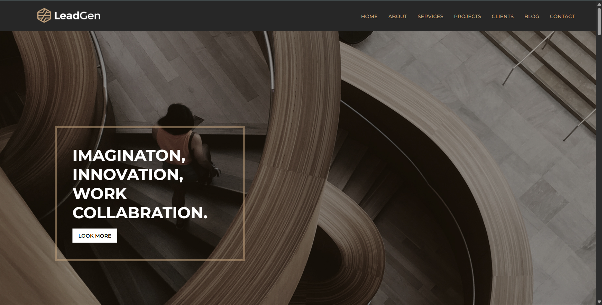

## Interior Design Site

A simple static website built using HTML and CSS for a construction company. This project is designed as a frontend demonstration for reviewers.

### Project Overview

- Showcases the design of a construction company website.

- Built using HTML5 and CSS3 only.

- Focused on layout and styling for desktop view.

- Not responsive (best viewed on larger screens).

- Intended to run locally for review purposes.

### Project Structure
Interior-design-Site/

│── index.html        # Main HTML file  
│── style.css         # Stylesheet  
│── images/           # Image assets used in the site  

### Prerequisites

- A web browser (Chrome, Firefox, Edge, etc.)

- A local server (optional) – you can use VS Code Live Server Extension for a smoother experience.

### Steps to Run

- Clone the repository:

git clone https://github.com/Jeevanantham-K-03/Interior-design-Site.git

- Open the project folder.

Open index.html in your browser or use a local server (like VS Code Live Server).

### Features

- Clean and professional design for a construction company.

- Static pages with HTML and CSS only.

- Organized folder structure for easy modification.

### Preview

### Built With

1. HTML5 – Structure

2. CSS3 – Styling

### H2 Note

- This project is not responsive (desktop-only layout).

- Intended for review/demo purposes only.
